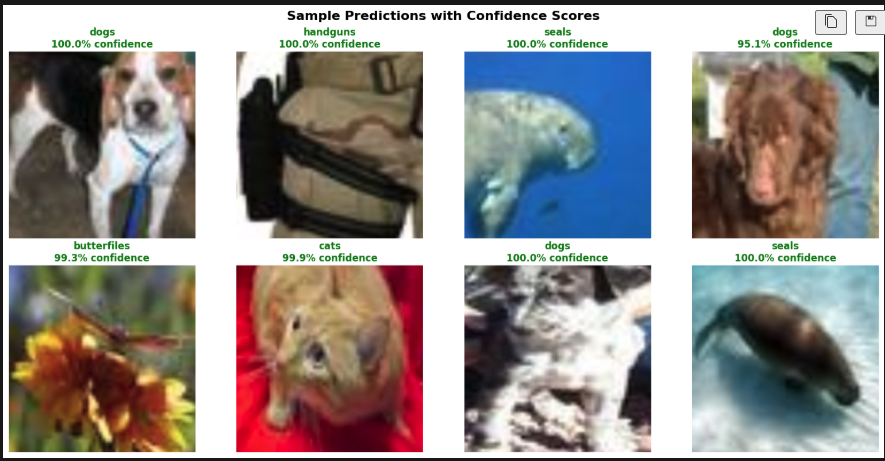

# Multi-Class Object Classification with ConvNeXt

🏆 **Achieved 99.79% validation accuracy** using transfer learning with ConvNeXt-Base-384-22k on a 20-class object classification task.

## 🎯 Project Overview
This project demonstrates advanced transfer learning techniques for multi-class image classification, achieving state-of-the-art performance on a diverse dataset of 20 object categories including animals, food items, and everyday objects.

### Key Achievements
- **99.79% validation accuracy** in just 2 epochs
- **Two-phase training strategy**: Frozen backbone → Full fine-tuning
- **Robust data pipeline**: Separate train/val datasets to prevent corruption
- **Professional implementation**: Early stopping, gradient clipping, checkpointing

## 📊 Dataset
- **8,000+ images** across 20 categories
- **Animals (14)**: birds, butterflies, cats, chickens, cows, dogs, ducks, elephants, fishes, horses, lions, seals, snakes, spiders
- **Objects (6)**: bottles, breads, cakes, handguns, lipsticks, vases

## 🧠 Technical Architecture
- **Model**: ConvNeXt-Base-384-22k (85.8M parameters)
- **Pre-training**: ImageNet-22k (more diverse than ImageNet-1k)
- **Input Resolution**: 224×224 (optimized for available resources)
- **Framework**: PyTorch + Hugging Face Transformers

## 🚀 Training Strategy
### Phase 1: Classifier-Only Training
- Freeze pre-trained backbone
- Train only classification head
- **Result**: 99.79% validation accuracy

### Phase 2: Full Fine-Tuning
- Unfreeze all layers
- Lower learning rate (1e-4) with weight decay
- **Result**: Maintained peak performance

## 📈 Key Technical Features
- **Gradient Clipping**: Stabilizes training with large models
- **Early Stopping**: Prevents overfitting (patience=7)
- **Learning Rate Scheduling**: ReduceLROnPlateau for adaptive learning
- **Robust Data Handling**: Separate datasets prevent transform corruption
- **Comprehensive Logging**: Training history saved incrementally

## 🛠️ Technologies Used
- **Deep Learning**: PyTorch, Hugging Face Transformers
- **Data Processing**: torchvision, timm transforms
- **Visualization**: matplotlib, pandas
- **Model Architecture**: ConvNeXt (state-of-the-art CNN)

## 📊 Results


- **Final Accuracy**: 99.79%
- **Convergence**: Achieved peak performance in 2 epochs

## 🏃‍♂️ Quick Start
```bash
# Clone repository
git clone https://github.com/elopezm3/multi-class-object-classification-convnext.git
cd multi-class-object-classification-convnext

# Install dependencies
pip install -r requirements.txt

# Run training
jupyter notebook notebooks/multi_class_object_classification.ipynb
```

## 📋 Requirements
- Python 3.8+
- PyTorch 2.0+
- transformers
- timm
- See `requirements.txt` for complete list

## 🎓 Key Learnings
1. **Transfer learning** with modern architectures achieves excellent results quickly
2. **Proper data handling** (separate train/val datasets) is crucial for stability
3. **Two-phase training** maximizes pre-trained model potential
4. **ConvNeXt** offers excellent balance of performance and efficiency

## 📈 Future Improvements
- Test higher resolution inputs (384×384) with more compute
- Experiment with other ConvNeXt variants (Base-21K, Large-21K)
- Implement test-time augmentation
- Add model interpretability analysis

---
*This project showcases advanced deep learning techniques and achieves state-of-the-art performance on multi-class object classification.*

## 📞 Contact
- **LinkedIn**: https://www.linkedin.com/in/esteban-lopez-mejia-1a8860217/
- **Email**: estebanlopez_99@hotmail.com